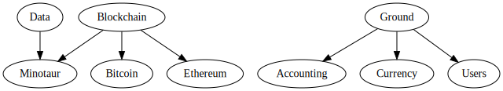
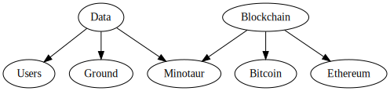

# Ecosystem Overview

## Vineyard

### Libraries

| Name  | Description |
|---|---|
| [**Server Templates**](https://github.com/vineyard-bloom/vineyard-server-template) | Templates for new projects |
| [**Lawn**](https://github.com/vineyard-bloom/vineyard-lawn) | Web service creation |
| [**Ground**](https://github.com/vineyard-bloom/vineyard-ground) | SQL ORM |
| [**Users**](https://github.com/vineyard-bloom/vineyard-users) | Authentication |
| [**Blockchain**](https://github.com/vineyard-bloom/vineyard-blockchain) | Universal blockchain type interfaces |
| [**Bitcoin**](https://github.com/vineyard-bloom/vineyard-bitcoin) | Bitcoin abstraction |
| [**Data**](https://github.com/vineyard-bloom/vineyard-data) | ORM interfaces |
| [**Ethereum**](https://github.com/vineyard-bloom/vineyard-ethereum) | Ethereum abstraction |
| [**Minotaur**](https://github.com/vineyard-bloom/vineyard-minotaur) | Blockchain monitoring |
| [**Currency**](https://github.com/vineyard-bloom/vineyard-currency) | Exchange rate aggregation and conversion |
| [**Cron**](https://github.com/vineyard-bloom/vineyard-cron) | Repeated tasks |
| [**Accounting**](https://github.com/vineyard-bloom/vineyard-accounting) | Account ledger |
| [**Docs**](https://github.com/vineyard-bloom/vineyard-docs) | Documentation generation |

### Dependency Graph

Most Vineyard libraries can be used independently.  Here are the cross dependencies between vineyard libraries:

#### Current

#### Future

## Bloom Libraries

Info will be added here soon
